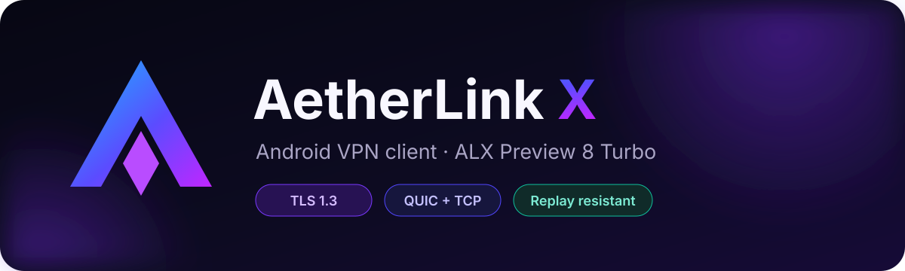
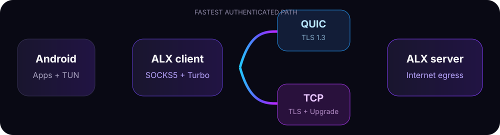

<div align="center">
  
</div>

<div align="center">

[](https://github.com/AetherLinkX/aetherlink-x/actions/workflows/build-aetherlinkx-client-android.yml)
[](https://github.com/AetherLinkX/aetherlink-x/actions/workflows/build-aetherlinkx-native-server.yml)
[](https://github.com/AetherLinkX/aetherlink-x/releases)
[](LICENSE)
[](client/README.md)

**A polished Android VPN client and the independent ALX Preview 8 Turbo transport.**

[Download](https://github.com/AetherLinkX/aetherlink-x/releases/tag/client-v0.8.3-alx-preview.8-rw.1) ·
[Explore ALX](core/alx/README.md) ·
[Architecture](docs/ARCHITECTURE.md) ·
[Русский](README.ru.md)

</div>

---

## Two projects, one repository

| AetherLink X for Android | ALX Preview 8 Turbo |
|---|---|
| A modern VPN client with profiles, subscriptions, diagnostics, split tunnelling and light/dark themes. | An independent authenticated tunnel with adaptive QUIC/TCP transport, TLS 1.3 and a compact framing layer. |
| [`client/android`](client/android) · [Client guide](client/README.md) | [`core/alx`](core/alx) · [Protocol guide](core/alx/README.md) |

The Android application keeps compatibility with ordinary Xray locations. ALX
profiles are an additional transport and do not replace VLESS/REALITY,
VMess, Trojan, Shadowsocks or other supported profiles.

## Preview 8 highlights

- **Turbo path selection** — races QUIC and TCP, then keeps the first
  authenticated path that works on the current network.
- **Standard cryptography** — TLS 1.3 and QUIC provide encryption; the project
  does not invent or advertise an unreviewed cipher.
- **Session-bound access** — HMAC-SHA256 authentication is tied to the active
  TLS session, a timestamp and a random nonce.
- **Replay resistance** — reused authentication frames are rejected and
  invalid probes are rate-limited.
- **Certificate pinning** — the client verifies the server's SHA-256 SPKI pin.
- **Safe key rotation** — a new token can be rolled out while up to two
  previous tokens remain temporarily valid.
- **No artificial overhead** — Turbo adds no padding, fake traffic or random
  delays and does not require a CDN.

<div align="center">
  
</div>

## Verified release

The current release is **AetherLink X 0.8.2 / ALX Preview 8**. Its release
candidate was exercised on a physical Android device with:

| Check | Result |
|---|---:|
| HTTPS requests through the tunnel | 10 / 10 |
| Google, YouTube, Telegram and Cloudflare reachability | 4 / 4 |
| Disconnect/reconnect cycles with exit-IP verification | 3 / 3 |
| Recorded client failures in the final run | 0 |

These checks validate that the tested build works; they are not a claim of a
formal security audit or universal network performance. Reproduce the checks
with the scripts in [`tools`](tools/README.md).

## Get the builds

- [Android client 0.8.3 — Remnawave Preview](https://github.com/AetherLinkX/aetherlink-x/releases/tag/client-v0.8.3-alx-preview.8-rw.1)
- [Linux amd64/arm64 ALX server — Remnawave Preview](https://github.com/AetherLinkX/aetherlink-x/releases/tag/server-v0.2.1-alx-preview.8-rw.1)
- [Previously verified Android client 0.8.2](https://github.com/AetherLinkX/aetherlink-x/releases/tag/client-v0.8.2-alx-preview.8)

Release assets are built by GitHub Actions. Compare downloaded files with the
published SHA-256 checksum before installation.

## Build from source

```bash
# ALX core, server and diagnostics
cd core/alx
go mod download
go mod verify
go test ./...
go build -trimpath -ldflags='-s -w' -o alx-server ./cmd/alx-server
```

Android requires JDK 21, the Android SDK and the native dependencies described
in the [client build guide](client/README.md). The release workflow pins the
upstream revisions used for reproducible builds.

## Remnawave deployment

The [Remnawave installer](core/alx/deploy/remnawave/README.md) deploys the
official Remnawave Node and ALX Turbo side by side on Debian or Ubuntu, obtains
and renews the TLS certificate, configures systemd and UFW, and emits the
private `X-AetherLink-Profile` subscription header. Its compatibility adapter
supports both legacy `APP_PORT`/`SSL_CERT` and current
`NODE_PORT`/`SECRET_KEY` Node environments without modifying the panel. With a
panel URL and scoped API token it also registers the Node and configures the ALX
External Squad automatically.

## Project map

```text
client/android/       Android client and UI
core/alx/             ALX protocol, client, server and tests
core/alx/deploy/      Deployment templates and Remnawave installer
test-server/          Preserved VLESS/REALITY comparison baseline
tools/                Physical-device diagnostics
.github/workflows/    Reproducible release pipelines
```

## Security

ALX Preview 8 is experimental software and has not received an independent
security audit. Do not publish tokens, private keys, complete share links or
generated client configs. Please report security issues using the instructions
in [SECURITY.md](SECURITY.md).

## License and attribution

Source code is available under the [Mozilla Public License 2.0](LICENSE).
The Android application includes third-party components under their respective
licenses; see [NOTICE.md](NOTICE.md) and
[`client/android/THIRD_PARTY_NOTICES.md`](client/android/THIRD_PARTY_NOTICES.md).
